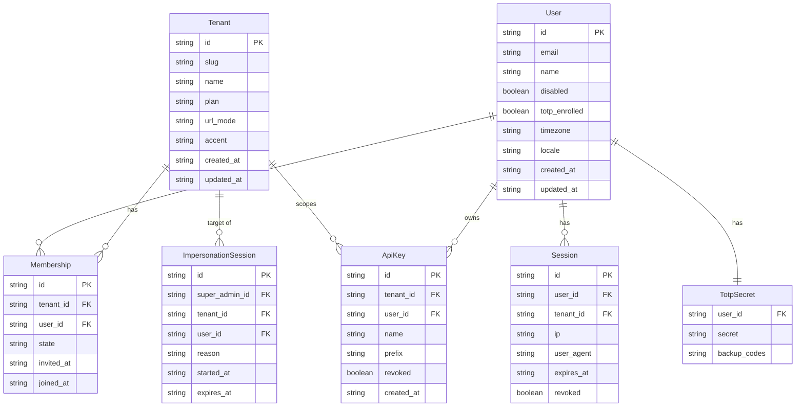
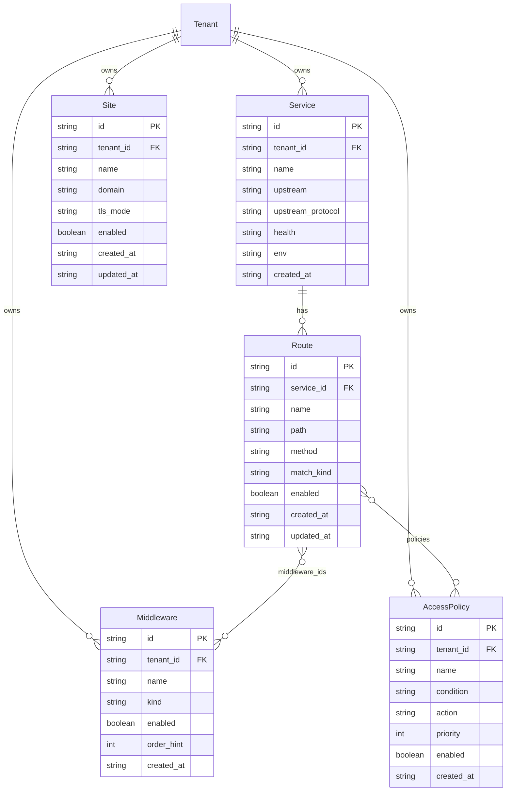
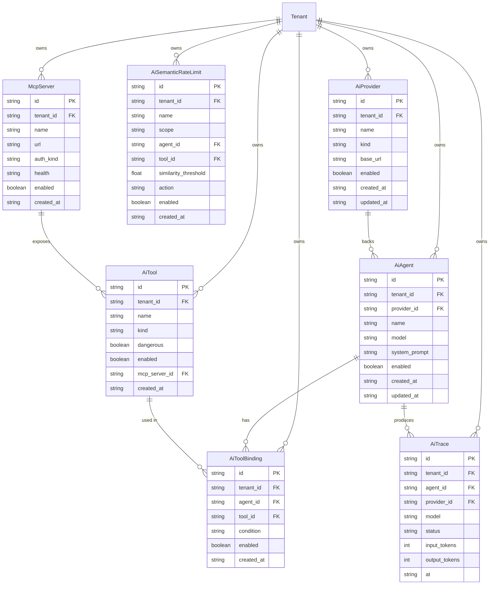
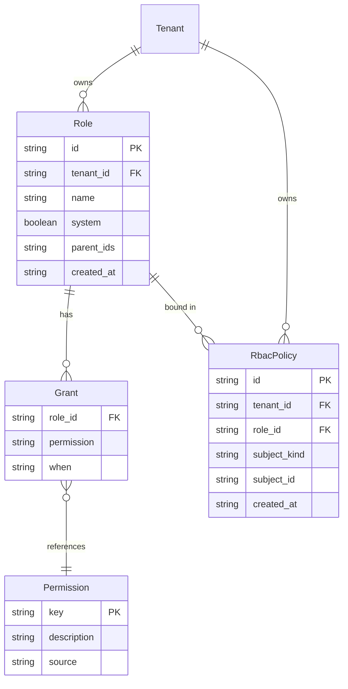
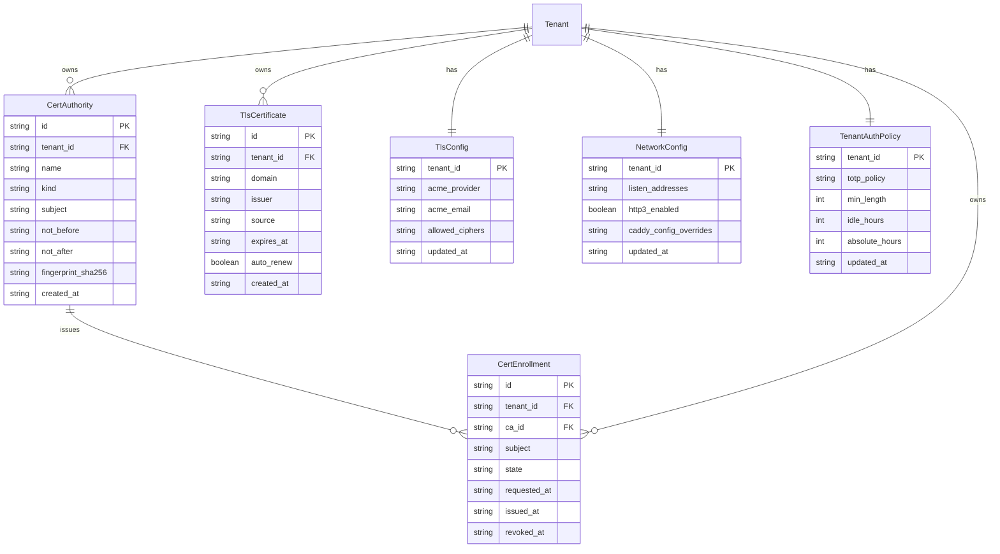
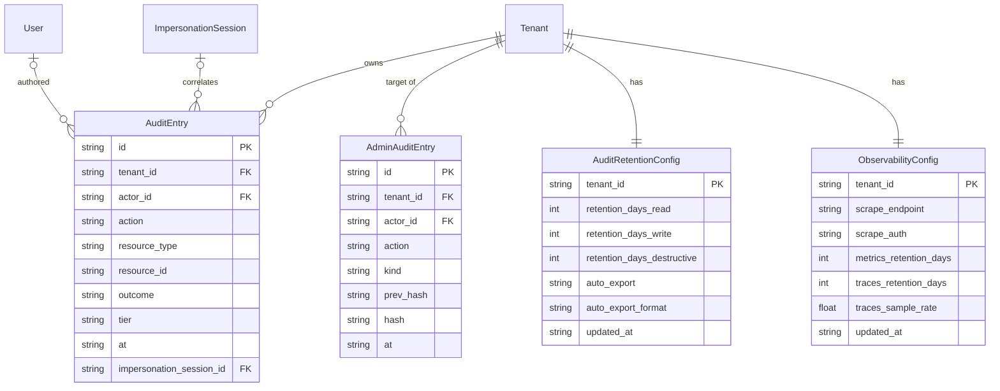
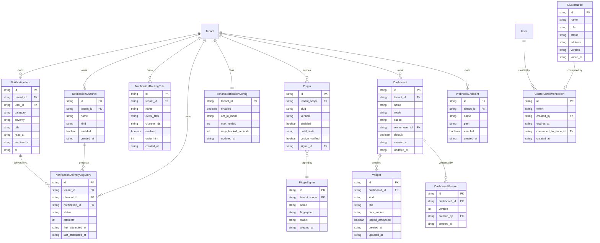

# Stage-2 Daemon API + DB Spec (derived from admin mock)

> Commit: 76a4973. Every item traces back to an entity in `packages/web/src/api/resources/types.ts` or a function in `packages/web/src/features/*/api.ts`. No aspirational scope — only what the mock does.

---

## 1. Feature Inventory

_Derived from `packages/web/src/components/app-shell/sidebar.tsx` (grouping), `packages/web/src/routes/t.$tenant/` (routes), and `packages/web/src/features/*/api.ts` (actions)._

### General

- **Dashboard** (`/t/:tenant/dashboard`)
  - View home dashboard (redirects to user's home or tenant default)
  - Set personal home dashboard

- **Sites** (`/t/:tenant/sites`)
  - List sites
  - Create site (domain, TLS mode, upstream service)
  - Update site (name, domain, TLS mode, basic auth, rate-limit preset, redirect rules)
  - Delete site (domain-typed confirmation)
  - Toggle site enabled/disabled

- **Notifications** (`/t/:tenant/notifications`)
  - List inbox notifications (own user, filterable by category, severity, read/archived)
  - View notification detail (with action link)
  - Mark notification read
  - Mark all notifications read
  - Archive notification
  - Unarchive notification
  - Live inbox stream (SSE/bus)

### Analytics

- **Insights / Dashboards** (`/t/:tenant/dashboards`)
  - List dashboards (own + shared + tenant)
  - Create dashboard (name, mode, scope, variables)
  - Update dashboard (name, description, scope, shared_role_ids, variables)
  - Delete dashboard
  - Set tenant default dashboard
  - Set personal home dashboard
  - View dashboard (viewer)
  - Open dashboard builder / editor
  - Dashboard version history (list versions)
  - Restore dashboard version
  - Export dashboard as JSON
  - Import dashboard from JSON

- **Widgets** (on dashboards, via `/t/:tenant/dashboards/:id/edit`)
  - Add widget (kind, title, data_source, config, position)
  - Update widget (title, config, wizard_state, raw_query)
  - Remove widget
  - Update layout (grid positions for all widgets)
  - Flip widget to advanced mode (raw query)
  - Flip widget back to wizard mode
  - Widget data preview (mock data-source fetch)
  - Widget kinds: `single-stat`, `sparkline`, `time-series`, `stacked-bar`, `table`, `pie`, `service-map`, `log-viewer`, `audit-tail`, `top-n` (plus plugin-registered kinds)

### AI

- **Providers** (`/t/:tenant/ai/providers`)
  - List AI providers (filterable)
  - View provider detail
  - Create provider (kind, name, base_url, credential, models)
  - Update provider
  - Delete provider
  - Test provider connectivity
  - Add model alias to provider
  - Update model alias (rate_limit_rpm, daily_quota_tokens, enabled)
  - Remove model alias from provider

- **Agents** (`/t/:tenant/ai/agents`)
  - List agents (filterable)
  - View agent detail (with bound tools and recent traces)
  - Create agent (provider, model, system_prompt, tool_ids, guardrails)
  - Update agent
  - Delete agent
  - Rotate scoped agent credential
  - Invoke agent (mock trace synthesis + live stream publish)

- **Tools** (`/t/:tenant/ai/tools`)
  - List tools (filterable)
  - View tool detail (with linked agents)
  - Create tool (kind, schema, http_endpoint or mcp_server_id)
  - Update tool
  - Delete tool
  - Test tool invocation

- **Tool Routing** (`/t/:tenant/ai/tool-routing`)
  - List tool-agent bindings (filterable)
  - View binding detail
  - Create binding (agent_id, tool_id, condition)
  - Update binding (condition, enabled)
  - Delete binding
  - Bulk attach tools to agent
  - Preview CEL condition

- **Rate Limits** (`/t/:tenant/ai/rate-limits`)
  - List semantic rate limits (filterable)
  - View rate limit detail
  - Create semantic rate limit (scope, exemplars, threshold, window, action)
  - Update rate limit
  - Delete rate limit
  - Simulate match (test a candidate text against rule)
  - View rate limit metrics chart

- **Traces** (`/t/:tenant/ai/traces`)
  - List traces (filterable by agent, status, date range)
  - View trace detail (with tool calls, prompt/completion — sensitive)
  - Live trace stream (SSE/bus subscribe)
  - Export traces as CSV

- **MCP Servers** (`/t/:tenant/ai/mcp-servers`)
  - List MCP servers (filterable)
  - View server detail (with exposed tools)
  - Create MCP server (url, auth_kind, authorized_agent_ids)
  - Update MCP server
  - Delete MCP server
  - Test MCP server connectivity

- **Access Policies** (`/t/:tenant/security/access-policies`) — also linked from AI sidebar
  - List access policies
  - View policy detail
  - Create access policy (condition CEL, action, priority)
  - Update access policy
  - Delete access policy

### API Management

- **Services** (`/t/:tenant/services`)
  - List services (filterable by health, env, tags)
  - View service detail (with routes)
  - Create service (upstream, protocol, env, health_check, tags)
  - Update service
  - Delete service
  - Force reload service into Caddy

- **Routes** (`/t/:tenant/routes`)
  - List routes (filterable by service, method, enabled)
  - View route detail
  - Create route (path, method, match_kind, middleware_ids, policies)
  - Update route
  - Delete route
  - Attach policy to route
  - Detach policy from route
  - Reorder middlewares on route

- **Policies** (`/t/:tenant/policies`)
  - (Same as Access Policies under Security — shared engine)
  - List, create, update, delete access policies

- **Middlewares** (`/t/:tenant/middlewares`)
  - List middlewares (filterable)
  - View middleware detail
  - Create middleware (kind, config, order_hint)
  - Update middleware
  - Delete middleware

- **API Explorer** (`/t/:tenant/api-explorer`)
  - Browse tenant's routes (read-only)
  - Inspect route detail (`_detail.$kind.$id` route)

### Security

- **Users** (`/t/:tenant/security/users`)
  - List users with membership state
  - View user detail (profile, sessions, memberships)
  - Invite user (email → creates pending membership)
  - Activate membership
  - Deactivate membership
  - Remove membership
  - Resend invite
  - Revoke invite
  - Disable user account
  - Enable user account
  - Delete user
  - Revoke a user's session
  - Update membership roles

- **Roles** (`/t/:tenant/security/roles`)
  - List roles (with user counts)
  - View role detail
  - Create role (name, parent_ids, grants, denies)
  - Update role
  - Delete role

- **API Keys** (`/t/:tenant/security/api-keys`)
  - List API keys (filterable)
  - View key detail (metadata only, no secret)
  - Create API key (name, scope, expiry)
  - Revoke API key
  - Rotate API key (returns new secret once)
  - Delete API key

- **RBAC Policies** (`/t/:tenant/security/rbac-policies`)
  - List RBAC policies
  - View RBAC policy detail
  - Create RBAC policy (subject_kind, subject_id, role_id)
  - Update RBAC policy
  - Delete RBAC policy

- **Sessions** (`/t/:tenant/security/sessions`)
  - List sessions (filterable by user)
  - Revoke session
  - Revoke all other sessions (bulk)

- **Audit** (`/t/:tenant/security/audit`)
  - List audit entries (filterable by actor, resource, tier, date, outcome)
  - Infinite-scroll audit list
  - View audit entry detail (diff, policies_evaluated)
  - Live audit stream (SSE/bus subscribe)
  - Search actors (typeahead)
  - Search resource IDs (typeahead)
  - Export audit CSV
  - Export audit JSONL
  - View audit retention config
  - Update audit retention config (per-tier retention_days, auto_export cadence)

### System

- **Cluster** (`/t/:tenant/cluster`)
  - List cluster nodes (with metrics)
  - View node detail
  - Remove node
  - List enrollment tokens (active)
  - Generate enrollment token
  - Revoke enrollment token

- **Plugins** (`/t/:tenant/plugins`)
  - List installed plugins (filterable)
  - View plugin detail (with audit tail)
  - Enable plugin
  - Disable plugin
  - Uninstall plugin
  - Install plugin (with approval flow, progress stream, cosign verification)
  - View plugin build log
  - Browse marketplace listings (filterable, by tag)
  - View marketplace listing detail
  - Install from marketplace reference

  - **Plugin Signers** (`/t/:tenant/plugins/signers`)
    - List plugin signers
    - View signer detail (with linked plugins)
    - Create signer (fingerprint, name)
    - Update signer
    - Delete signer
    - Verify signer (→ status=verified)
    - Revoke signer (→ status=revoked)

- **Settings** (`/t/:tenant/settings`)
  - **Profile**
    - View current user profile
    - Update display name
    - Update avatar URL
    - Change password
    - Reset backup codes (returns new codes once)
    - Update preferences (timezone, locale, reduced_motion, notification_preferences)
  - **Tenant General**
    - View current tenant
    - Update tenant name
    - Update tenant URL mode (path/subdomain)
    - Update tenant default theme
    - Update tenant logo
  - **Authentication Policy**
    - View tenant auth policy (TOTP, password, session timeouts)
    - Update tenant auth policy
  - **Network**
    - View network config (listen_addresses, Caddy overrides, HTTP3, timeouts)
    - Update network config
  - **PKI**
    - List certificate authorities
    - List cert enrollments
    - Add CA (kind, subject, certificate_pem)
    - Add cert enrollment (ca_id, subject, dns_sans)
    - Revoke cert enrollment (with reason)
  - **TLS**
    - List TLS certificates
    - View TLS config (ACME provider, ciphers)
    - Add TLS certificate (manual upload)
    - Toggle cert auto-renew
    - Delete TLS certificate
    - Update ACME config
    - Update cipher suites
  - **Observability**
    - View observability config (metrics, logs, traces)
    - Update metrics config (scrape_endpoint, scrape_auth, retention)
    - Update log config (levels, format, rotation)
    - Update traces config (retention_days, sample_rate)
  - **Integrations / Webhooks**
    - List webhook endpoints
    - Add webhook endpoint
    - Update webhook endpoint
    - Delete webhook endpoint
  - **Notifications Config**
    - View tenant notification config
    - Update notification config (master toggle, opt-in mode, retry policy, channel priority)
    - View notification channel count summary
    - View delivery log summary
  - **Danger Zone**
    - Hard reset tenant (triple-confirm)
    - Export tenant data as JSON
    - Delete tenant (super-admin only, triple-confirm)

### Auth (unauthenticated)

- Login (email + password → step 1)
- TOTP verification (step 2)
- Enroll TOTP (get QR/secret)
- Confirm TOTP enrollment
- Verify backup code
- Request password reset (email)
- Validate reset token
- Apply password reset (new password)
- Accept invite (token → activate membership)
- Bootstrap (seed initial admin if DB empty)

### Super-Admin (`/admin/`)

- View tenant inventory (list all tenants)
- View cross-tenant users
- View admin audit log (hash-chained)
- Start impersonation session (entry form, TOTP, profile/scope selection)
- End impersonation session
- Extend impersonation session idle timer
- Manage plugin signers (global scope)

---

## 2. REST API Matrix

_Derived from every `features/*/api.ts` selector and mutation. Prefix rules: `/api/v1/t/:tenant/` for tenant-scoped; `/api/v1/admin/` for super-admin; `/api/v1/auth/` for unauthenticated auth flows._

### Auth

| Verb | Path | Purpose (mock function) | Permission | Stream | Notes |
|------|------|-------------------------|------------|--------|-------|
| POST | `/api/v1/auth/login` | `login` | — | No | Step 1; returns `{totp_required}` |
| POST | `/api/v1/auth/totp/verify` | `verifyTotp` | — | No | Step 2 |
| POST | `/api/v1/auth/logout` | `logout` | — | No | |
| POST | `/api/v1/auth/totp/enroll` | `enrollTotp` | — | No | Returns QR + secret |
| POST | `/api/v1/auth/totp/confirm` | `confirmTotpEnrollment` | — | No | |
| POST | `/api/v1/auth/backup-code/verify` | `verifyBackupCode` | — | No | |
| POST | `/api/v1/auth/password-reset/request` | `requestPasswordReset` | — | No | |
| GET | `/api/v1/auth/password-reset/validate` | `validateResetToken` | — | No | |
| POST | `/api/v1/auth/password-reset/apply` | `applyPasswordReset` | — | No | |
| POST | `/api/v1/auth/invite/accept` | `acceptInvite` | — | No | |
| POST | `/api/v1/auth/bootstrap` | `bootstrap` | — | No | One-shot seed |

### Settings — Profile (own user)

| Verb | Path | Purpose (mock function) | Permission | Stream | Notes |
|------|------|-------------------------|------------|--------|-------|
| GET | `/api/v1/t/:tenant/settings/me` | `useCurrentUser` | `user:update-own` | No | |
| PATCH | `/api/v1/t/:tenant/settings/me/name` | `updateProfileName` | `user:update-own` | No | |
| PATCH | `/api/v1/t/:tenant/settings/me/avatar` | `updateProfileAvatar` | `user:update-own` | No | |
| POST | `/api/v1/t/:tenant/settings/me/password` | `changePassword` | `user:update-own` | No | |
| POST | `/api/v1/t/:tenant/settings/me/backup-codes/reset` | `resetBackupCodes` | `user:update-own` | No | Returns codes once |
| PATCH | `/api/v1/t/:tenant/settings/me/preferences` | `updatePreferences` | `user:update-own` | No | timezone, locale, reduced_motion, notification_preferences |

### Settings — Tenant General

| Verb | Path | Purpose (mock function) | Permission | Stream | Notes |
|------|------|-------------------------|------------|--------|-------|
| GET | `/api/v1/t/:tenant/settings/tenant` | `useCurrentTenant` | `tenant:read` | No | |
| PATCH | `/api/v1/t/:tenant/settings/tenant/name` | `updateTenantName` | `tenant:write` | No | |
| PATCH | `/api/v1/t/:tenant/settings/tenant/url-mode` | `updateTenantUrlMode` | `tenant:write` | No | |
| PATCH | `/api/v1/t/:tenant/settings/tenant/theme` | `updateTenantDefaultTheme` | `tenant:write` | No | |
| PATCH | `/api/v1/t/:tenant/settings/tenant/logo` | `updateTenantLogo` | `tenant:write` | No | |

### Settings — Auth Policy

| Verb | Path | Purpose (mock function) | Permission | Stream | Notes |
|------|------|-------------------------|------------|--------|-------|
| GET | `/api/v1/t/:tenant/settings/auth-policy` | `useCurrentTenantAuthPolicy` | `tenant-auth:read` | No | |
| PUT | `/api/v1/t/:tenant/settings/auth-policy` | `updateTenantAuthPolicy` | `tenant-auth:write` | No | |

### Settings — Network

| Verb | Path | Purpose (mock function) | Permission | Stream | Notes |
|------|------|-------------------------|------------|--------|-------|
| GET | `/api/v1/t/:tenant/settings/network` | `useCurrentNetworkConfig` | `network:read` | No | |
| PUT | `/api/v1/t/:tenant/settings/network` | `updateNetworkConfig` | `network:write` | No | |

### Settings — PKI

| Verb | Path | Purpose (mock function) | Permission | Stream | Notes |
|------|------|-------------------------|------------|--------|-------|
| GET | `/api/v1/t/:tenant/settings/pki/cas` | `useCertAuthorities` | `pki:read` | No | |
| POST | `/api/v1/t/:tenant/settings/pki/cas` | `addCertAuthority` | `pki:write` | No | |
| GET | `/api/v1/t/:tenant/settings/pki/enrollments` | `useCertEnrollments` | `pki:read` | No | |
| POST | `/api/v1/t/:tenant/settings/pki/enrollments` | `addCertEnrollment` | `pki:write` | No | |
| POST | `/api/v1/t/:tenant/settings/pki/enrollments/:id/revoke` | `revokeCertEnrollment` | `pki:write` | No | |

### Settings — TLS

| Verb | Path | Purpose (mock function) | Permission | Stream | Notes |
|------|------|-------------------------|------------|--------|-------|
| GET | `/api/v1/t/:tenant/settings/tls/certificates` | `useTlsCertificates` | `tls:read` | No | |
| POST | `/api/v1/t/:tenant/settings/tls/certificates` | `addTlsCertificate` | `tls:write` | No | |
| PATCH | `/api/v1/t/:tenant/settings/tls/certificates/:id/auto-renew` | `toggleCertAutoRenew` | `tls:write` | No | |
| DELETE | `/api/v1/t/:tenant/settings/tls/certificates/:id` | `deleteTlsCertificate` | `tls:write` | No | |
| GET | `/api/v1/t/:tenant/settings/tls/config` | `useCurrentTlsConfig` | `tls:read` | No | |
| PUT | `/api/v1/t/:tenant/settings/tls/config/acme` | `updateTlsAcmeConfig` | `tls:write` | No | |
| PUT | `/api/v1/t/:tenant/settings/tls/config/ciphers` | `updateTlsCiphers` | `tls:write` | No | |

### Settings — Observability

| Verb | Path | Purpose (mock function) | Permission | Stream | Notes |
|------|------|-------------------------|------------|--------|-------|
| GET | `/api/v1/t/:tenant/settings/observability` | `useCurrentObservabilityConfig` | `metrics:read` | No | |
| PUT | `/api/v1/t/:tenant/settings/observability/metrics` | `updateObservabilityMetrics` | `metrics:write` | No | |
| PUT | `/api/v1/t/:tenant/settings/observability/logs` | `updateObservabilityLogs` | `logs:write` | No | |
| PUT | `/api/v1/t/:tenant/settings/observability/traces` | `updateObservabilityTraces` | `traces:write` | No | |

### Settings — Integrations (Webhooks)

| Verb | Path | Purpose (mock function) | Permission | Stream | Notes |
|------|------|-------------------------|------------|--------|-------|
| GET | `/api/v1/t/:tenant/settings/webhooks` | `useWebhookEndpoints` | `integrations:read` | No | |
| POST | `/api/v1/t/:tenant/settings/webhooks` | `addWebhookEndpoint` | `integrations:write` | No | |
| PATCH | `/api/v1/t/:tenant/settings/webhooks/:id` | `updateWebhookEndpoint` | `integrations:write` | No | |
| DELETE | `/api/v1/t/:tenant/settings/webhooks/:id` | `deleteWebhookEndpoint` | `integrations:write` | No | |

### Settings — Notification Config

| Verb | Path | Purpose (mock function) | Permission | Stream | Notes |
|------|------|-------------------------|------------|--------|-------|
| GET | `/api/v1/t/:tenant/settings/notifications` | `useCurrentNotificationConfig` | `notification:admin` | No | |
| PUT | `/api/v1/t/:tenant/settings/notifications` | `updateTenantNotificationConfig` | `notification:admin` | No | |

### Settings — Danger Zone

| Verb | Path | Purpose (mock function) | Permission | Stream | Notes |
|------|------|-------------------------|------------|--------|-------|
| POST | `/api/v1/t/:tenant/settings/danger/hard-reset` | `hardResetTenant` | `tenant:hard-reset` | No | Triple-confirm |
| GET | `/api/v1/t/:tenant/settings/danger/export` | `exportTenantJson` | `tenant:export` | No | Returns JSON blob |
| DELETE | `/api/v1/t/:tenant/settings/danger/tenant` | `deleteTenant` | `tenant:delete` (super-admin) | No | Triple-confirm |

### Services

| Verb | Path | Purpose (mock function) | Permission | Stream | Notes |
|------|------|-------------------------|------------|--------|-------|
| GET | `/api/v1/t/:tenant/services` | `useServiceList` | `service:read` | No | Filter: health, env, tags |
| GET | `/api/v1/t/:tenant/services/:id` | `useServiceDetail` | `service:read` | No | |
| GET | `/api/v1/t/:tenant/services/:id/routes` | `useServiceRoutes` | `service:read` | No | |
| POST | `/api/v1/t/:tenant/services` | `createService` | `service:write` | No | |
| PUT | `/api/v1/t/:tenant/services/:id` | `updateService` | `service:write` | No | |
| DELETE | `/api/v1/t/:tenant/services/:id` | `deleteService` | `service:delete` | No | |
| POST | `/api/v1/t/:tenant/services/:id/force-reload` | `forceReloadService` | `service:force-reload` | No | |

### Routes

| Verb | Path | Purpose (mock function) | Permission | Stream | Notes |
|------|------|-------------------------|------------|--------|-------|
| GET | `/api/v1/t/:tenant/routes` | `useRouteList` | `route:read` | No | Filter: service_id, method, enabled |
| GET | `/api/v1/t/:tenant/routes/:id` | `useRouteDetail` | `route:read` | No | |
| POST | `/api/v1/t/:tenant/routes` | `createRoute` | `route:write` | No | |
| PUT | `/api/v1/t/:tenant/routes/:id` | `updateRoute` | `route:write` | No | |
| DELETE | `/api/v1/t/:tenant/routes/:id` | `deleteRoute` | `route:delete` | No | |
| POST | `/api/v1/t/:tenant/routes/:id/policies/:policyId` | `attachPolicy` | `route:attach-policy` | No | |
| DELETE | `/api/v1/t/:tenant/routes/:id/policies/:policyId` | `detachPolicy` | `route:attach-policy` | No | |
| PUT | `/api/v1/t/:tenant/routes/:id/middlewares/order` | `reorderMiddlewares` | `route:write` | No | |

### Middlewares

| Verb | Path | Purpose (mock function) | Permission | Stream | Notes |
|------|------|-------------------------|------------|--------|-------|
| GET | `/api/v1/t/:tenant/middlewares` | `useMiddlewareList` | `middleware:read` | No | |
| GET | `/api/v1/t/:tenant/middlewares/:id` | `useMiddlewareDetail` | `middleware:read` | No | |
| POST | `/api/v1/t/:tenant/middlewares` | `createMiddleware` | `middleware:write` | No | |
| PUT | `/api/v1/t/:tenant/middlewares/:id` | `updateMiddleware` | `middleware:write` | No | |
| DELETE | `/api/v1/t/:tenant/middlewares/:id` | `deleteMiddleware` | `middleware:delete` | No | |

### Access Policies (API management + AI shared)

| Verb | Path | Purpose (mock function) | Permission | Stream | Notes |
|------|------|-------------------------|------------|--------|-------|
| GET | `/api/v1/t/:tenant/policies` | `useAccessPolicyList` | `policy:read` | No | |
| GET | `/api/v1/t/:tenant/policies/:id` | `useAccessPolicy` | `policy:read` | No | |
| POST | `/api/v1/t/:tenant/policies` | `createAccessPolicyMutation` | `policy:write` | No | |
| PUT | `/api/v1/t/:tenant/policies/:id` | `updateAccessPolicyMutation` | `policy:write` | No | |
| DELETE | `/api/v1/t/:tenant/policies/:id` | `deleteAccessPolicyMutation` | `policy:delete` | No | |

### Sites

| Verb | Path | Purpose (mock function) | Permission | Stream | Notes |
|------|------|-------------------------|------------|--------|-------|
| GET | `/api/v1/t/:tenant/sites` | `useSiteList` | `site:read` | No | |
| GET | `/api/v1/t/:tenant/sites/:id` | `useSiteDetail` | `site:read` | No | |
| POST | `/api/v1/t/:tenant/sites` | `createSite` | `site:write` | No | |
| PUT | `/api/v1/t/:tenant/sites/:id` | `updateSite` | `site:write` | No | |
| DELETE | `/api/v1/t/:tenant/sites/:id` | `deleteSite` | `site:delete` | No | Domain-typed confirm |
| PATCH | `/api/v1/t/:tenant/sites/:id/enabled` | `toggleSite` | `site:write` | No | |

### Security — Users

| Verb | Path | Purpose (mock function) | Permission | Stream | Notes |
|------|------|-------------------------|------------|--------|-------|
| GET | `/api/v1/t/:tenant/users` | `useUserList` | `user:read` | No | |
| GET | `/api/v1/t/:tenant/users/:id` | `useUserDetail` | `user:read` | No | |
| GET | `/api/v1/t/:tenant/users/:id/sessions` | `useUserSessions` | `session:read` | No | |
| POST | `/api/v1/t/:tenant/users/invite` | `inviteUser` | `user:invite` | No | |
| POST | `/api/v1/t/:tenant/memberships/:id/activate` | `activateMembership` | `user:invite` | No | |
| POST | `/api/v1/t/:tenant/memberships/:id/deactivate` | `deactivateMembership` | `user:disable` | No | |
| DELETE | `/api/v1/t/:tenant/memberships/:id` | `removeMembership` | `user:disable` | No | |
| POST | `/api/v1/t/:tenant/memberships/:id/resend-invite` | `resendInvite` | `user:invite` | No | |
| DELETE | `/api/v1/t/:tenant/memberships/:id/invite` | `revokeInvite` | `user:invite` | No | |
| PUT | `/api/v1/t/:tenant/memberships/:id/roles` | `updateMembershipRoles` | `role:write` | No | |
| POST | `/api/v1/t/:tenant/users/:id/disable` | `disableUser` | `user:disable` | No | |
| POST | `/api/v1/t/:tenant/users/:id/enable` | `enableUser` | `user:disable` | No | |
| DELETE | `/api/v1/t/:tenant/users/:id` | `deleteUser` | `user:disable` | No | |
| DELETE | `/api/v1/t/:tenant/sessions/:id` | `revokeSession` (users feature) | `session:revoke` | No | |

### Security — Roles

| Verb | Path | Purpose (mock function) | Permission | Stream | Notes |
|------|------|-------------------------|------------|--------|-------|
| GET | `/api/v1/t/:tenant/roles` | `useRoleList` | `role:read` | No | |
| GET | `/api/v1/t/:tenant/roles/:id` | `useRole` | `role:read` | No | |
| POST | `/api/v1/t/:tenant/roles` | `createRoleMutation` | `role:write` | No | |
| PATCH | `/api/v1/t/:tenant/roles/:id` | `updateRoleMutation` | `role:write` | No | |
| DELETE | `/api/v1/t/:tenant/roles/:id` | `deleteRoleMutation` | `role:delete` | No | |

### Security — API Keys

| Verb | Path | Purpose (mock function) | Permission | Stream | Notes |
|------|------|-------------------------|------------|--------|-------|
| GET | `/api/v1/t/:tenant/api-keys` | `useApiKeyList` | `api-key:read` | No | |
| GET | `/api/v1/t/:tenant/api-keys/:id` | `useApiKey` | `api-key:read` | No | |
| POST | `/api/v1/t/:tenant/api-keys` | `createApiKey` | `api-key:create` | No | Returns secret once |
| POST | `/api/v1/t/:tenant/api-keys/:id/revoke` | `revokeApiKey` | `api-key:delete` | No | |
| POST | `/api/v1/t/:tenant/api-keys/:id/rotate` | `rotateApiKey` | `api-key:create` | No | Returns new secret once |
| DELETE | `/api/v1/t/:tenant/api-keys/:id` | `deleteApiKey` | `api-key:delete` | No | |

### Security — Sessions

| Verb | Path | Purpose (mock function) | Permission | Stream | Notes |
|------|------|-------------------------|------------|--------|-------|
| GET | `/api/v1/t/:tenant/sessions` | `useSessionList` | `session:read` | No | |
| DELETE | `/api/v1/t/:tenant/sessions/:id` | `revokeSession` | `session:revoke` | No | |
| POST | `/api/v1/t/:tenant/sessions/revoke-others` | `revokeAllOtherSessions` | `session:revoke` | No | |

### Security — RBAC Policies

| Verb | Path | Purpose (mock function) | Permission | Stream | Notes |
|------|------|-------------------------|------------|--------|-------|
| GET | `/api/v1/t/:tenant/rbac-policies` | `useRbacPolicyList` | `policy:read` | No | |
| GET | `/api/v1/t/:tenant/rbac-policies/:id` | `useRbacPolicy` | `policy:read` | No | |
| POST | `/api/v1/t/:tenant/rbac-policies` | `createRbacPolicyMutation` | `policy:write` | No | |
| PUT | `/api/v1/t/:tenant/rbac-policies/:id` | `updateRbacPolicyMutation` | `policy:write` | No | |
| DELETE | `/api/v1/t/:tenant/rbac-policies/:id` | `deleteRbacPolicyMutation` | `policy:delete` | No | |

### Audit

| Verb | Path | Purpose (mock function) | Permission | Stream | Notes |
|------|------|-------------------------|------------|--------|-------|
| GET | `/api/v1/t/:tenant/audit` | `useAuditList` / `useAuditListInfinite` | `audit:read` | No | Filter: actor, resource_type, tier, outcome, date |
| GET | `/api/v1/t/:tenant/audit/:id` | `useAuditDetail` | `audit:read` | No | Sensitive fields need `audit:read-sensitive` |
| GET | `/api/v1/t/:tenant/audit/stream` | `subscribeAuditStream` | `audit:read` | **SSE** | |
| GET | `/api/v1/t/:tenant/audit/export/csv` | `exportAuditCsv` | `audit:export` | No | |
| GET | `/api/v1/t/:tenant/audit/export/jsonl` | `exportAuditJsonl` | `audit:export` | No | |
| GET | `/api/v1/t/:tenant/audit/actors` | `searchActors` | `audit:read` | No | Typeahead |
| GET | `/api/v1/t/:tenant/audit/resource-ids` | `searchResourceIds` | `audit:read` | No | Typeahead |
| GET | `/api/v1/t/:tenant/audit/retention` | `useRetentionConfig` | `audit:retention:read` | No | |
| PUT | `/api/v1/t/:tenant/audit/retention` | `updateRetentionConfig` | `audit:retention:write` | No | |

### Dashboards

| Verb | Path | Purpose (mock function) | Permission | Stream | Notes |
|------|------|-------------------------|------------|--------|-------|
| GET | `/api/v1/t/:tenant/dashboards` | `useDashboardList` | `dashboard:read` | No | Filter: scope, mode |
| GET | `/api/v1/t/:tenant/dashboards/:id` | `useDashboardDetail` | `dashboard:read` | No | |
| GET | `/api/v1/t/:tenant/dashboards/:id/widgets` | `useDashboardWidgets` | `dashboard:read` | No | |
| GET | `/api/v1/t/:tenant/dashboards/:id/versions` | `useDashboardVersions` | `dashboard:read` | No | |
| POST | `/api/v1/t/:tenant/dashboards` | `createDashboard` | `dashboard:write` | No | |
| PUT | `/api/v1/t/:tenant/dashboards/:id` | `updateDashboard` | `dashboard:write` | No | |
| DELETE | `/api/v1/t/:tenant/dashboards/:id` | `deleteDashboard` | `dashboard:delete` | No | |
| POST | `/api/v1/t/:tenant/dashboards/:id/set-default` | `setDefaultDashboard` | `dashboard:set-default` | No | |
| POST | `/api/v1/t/:tenant/dashboards/:id/set-home` | `setAsMyHome` | `dashboard:write` | No | Per-user |
| POST | `/api/v1/t/:tenant/dashboards/:id/snapshot` | `snapshotDashboard` | `dashboard:write` | No | Creates version |
| POST | `/api/v1/t/:tenant/dashboards/versions/:versionId/restore` | `restoreDashboardVersion` | `dashboard:write` | No | |
| GET | `/api/v1/t/:tenant/dashboards/:id/export` | `exportDashboardJson` | `dashboard:read` | No | |
| POST | `/api/v1/t/:tenant/dashboards/import` | `importDashboardJson` | `dashboard:write` | No | |
| POST | `/api/v1/t/:tenant/dashboards/:id/share` | `updateDashboard` (scope change) | `dashboard:share` | No | |

### Widgets (builder)

| Verb | Path | Purpose (mock function) | Permission | Stream | Notes |
|------|------|-------------------------|------------|--------|-------|
| POST | `/api/v1/t/:tenant/dashboards/:id/widgets` | `addWidget` | `dashboard:write` | No | |
| PUT | `/api/v1/t/:tenant/widgets/:id` | `updateWidget` | `dashboard:write` | No | |
| DELETE | `/api/v1/t/:tenant/dashboards/:dashboardId/widgets/:id` | `removeWidget` | `dashboard:write` | No | |
| PUT | `/api/v1/t/:tenant/dashboards/:id/layout` | `updateLayout` | `dashboard:write` | No | |
| POST | `/api/v1/t/:tenant/widgets/:id/flip-advanced` | `flipWidgetToAdvanced` | `dashboard:write` | No | |
| POST | `/api/v1/t/:tenant/widgets/:id/flip-wizard` | `flipWidgetToWizard` | `dashboard:write` | No | |

### Notifications — Inbox

| Verb | Path | Purpose (mock function) | Permission | Stream | Notes |
|------|------|-------------------------|------------|--------|-------|
| GET | `/api/v1/t/:tenant/notifications` | `useNotificationList` / `useNotificationListInfinite` | `notification:read` | No | Filter: category, severity, read, archived |
| GET | `/api/v1/t/:tenant/notifications/unread-count` | `useUnreadCount` | `notification:read` | No | |
| GET | `/api/v1/t/:tenant/notifications/:id` | `useNotificationDetail` | `notification:read` | No | |
| POST | `/api/v1/t/:tenant/notifications/:id/read` | `markRead` | `notification:manage-own` | No | |
| POST | `/api/v1/t/:tenant/notifications/read-all` | `markAllRead` | `notification:manage-own` | No | |
| POST | `/api/v1/t/:tenant/notifications/:id/archive` | `archive` | `notification:manage-own` | No | |
| POST | `/api/v1/t/:tenant/notifications/:id/unarchive` | `unarchive` | `notification:manage-own` | No | |
| GET | `/api/v1/t/:tenant/notifications/stream` | `subscribeInboxStream` | `notification:read` | **SSE** | |

### Notification Channels

| Verb | Path | Purpose (mock function) | Permission | Stream | Notes |
|------|------|-------------------------|------------|--------|-------|
| GET | `/api/v1/t/:tenant/notification-channels` | `useChannelList` | `notification-channel:read` | No | |
| GET | `/api/v1/t/:tenant/notification-channels/:id` | `useChannelDetail` | `notification-channel:read` | No | |
| POST | `/api/v1/t/:tenant/notification-channels` | `createChannel` | `notification-channel:write` | No | |
| PUT | `/api/v1/t/:tenant/notification-channels/:id` | `updateChannel` | `notification-channel:write` | No | |
| DELETE | `/api/v1/t/:tenant/notification-channels/:id` | `deleteChannel` | `notification-channel:write` | No | |
| POST | `/api/v1/t/:tenant/notification-channels/:id/test` | `testChannel` | `notification-channel:test` | No | |

### Notification Routing

| Verb | Path | Purpose (mock function) | Permission | Stream | Notes |
|------|------|-------------------------|------------|--------|-------|
| GET | `/api/v1/t/:tenant/notification-routing` | `useRoutingRuleList` | `notification-routing:read` | No | |
| GET | `/api/v1/t/:tenant/notification-routing/:id` | `useRoutingRuleDetail` | `notification-routing:read` | No | |
| POST | `/api/v1/t/:tenant/notification-routing` | `createRoutingRule` | `notification-routing:write` | No | |
| PUT | `/api/v1/t/:tenant/notification-routing/:id` | `updateRoutingRule` | `notification-routing:write` | No | |
| DELETE | `/api/v1/t/:tenant/notification-routing/:id` | `deleteRoutingRule` | `notification-routing:write` | No | |
| PUT | `/api/v1/t/:tenant/notification-routing/order` | `reorderRoutingRules` | `notification-routing:write` | No | |

### Notification Delivery Log

| Verb | Path | Purpose (mock function) | Permission | Stream | Notes |
|------|------|-------------------------|------------|--------|-------|
| GET | `/api/v1/t/:tenant/notification-log` | `useDeliveryLogList` / `useDeliveryLogListInfinite` | `notification-log:read` | No | |
| GET | `/api/v1/t/:tenant/notification-log/:id` | `useDeliveryLogDetail` | `notification-log:read` | No | |

### Plugins

| Verb | Path | Purpose (mock function) | Permission | Stream | Notes |
|------|------|-------------------------|------------|--------|-------|
| GET | `/api/v1/t/:tenant/plugins` | `useInstalledPluginList` | `plugin:read` | No | |
| GET | `/api/v1/t/:tenant/plugins/:id` | `useInstalledPlugin` | `plugin:read` | No | |
| GET | `/api/v1/t/:tenant/plugins/:id/build-log` | `getBuildLog` | `plugin:read` | No | |
| GET | `/api/v1/t/:tenant/plugins/:id/audit` | `usePluginAuditTail` | `plugin:read` + `audit:read` | No | |
| POST | `/api/v1/t/:tenant/plugins/:id/enable` | `enablePlugin` | `plugin:enable` | No | |
| POST | `/api/v1/t/:tenant/plugins/:id/disable` | `disablePlugin` | `plugin:enable` | No | |
| DELETE | `/api/v1/t/:tenant/plugins/:id` | `uninstallPlugin` | `plugin:uninstall` | No | |
| POST | `/api/v1/t/:tenant/plugins/install` | `installPlugin` / `installPluginWithProgress` | `plugin:install` | **SSE** (progress) | |
| GET | `/api/v1/t/:tenant/plugins/marketplace` | `useMarketplaceListings` | `plugin:read` | No | |
| GET | `/api/v1/t/:tenant/plugins/marketplace/:id` | `useMarketplaceListing` | `plugin:read` | No | |

### Plugin Signers

| Verb | Path | Purpose (mock function) | Permission | Stream | Notes |
|------|------|-------------------------|------------|--------|-------|
| GET | `/api/v1/t/:tenant/plugin-signers` | `useSignerList` | `plugin-signer:read` | No | |
| GET | `/api/v1/t/:tenant/plugin-signers/:id` | `useSignerDetail` | `plugin-signer:read` | No | |
| GET | `/api/v1/t/:tenant/plugin-signers/:id/plugins` | `useSignerPlugins` | `plugin-signer:read` | No | |
| POST | `/api/v1/t/:tenant/plugin-signers` | `createSigner` | `plugin-signer:write` | No | |
| PUT | `/api/v1/t/:tenant/plugin-signers/:id` | `updateSigner` | `plugin-signer:write` | No | |
| DELETE | `/api/v1/t/:tenant/plugin-signers/:id` | `deleteSigner` | `plugin-signer:delete` | No | |
| POST | `/api/v1/t/:tenant/plugin-signers/:id/verify` | `verifySigner` | `plugin-signer:write` | No | |
| POST | `/api/v1/t/:tenant/plugin-signers/:id/revoke` | `revokeSigner` | `plugin-signer:write` | No | |

### AI — Providers

| Verb | Path | Purpose (mock function) | Permission | Stream | Notes |
|------|------|-------------------------|------------|--------|-------|
| GET | `/api/v1/t/:tenant/ai/providers` | `useProviderList` | `ai-provider:read` | No | |
| GET | `/api/v1/t/:tenant/ai/providers/:id` | `useProviderDetail` | `ai-provider:read` | No | |
| GET | `/api/v1/t/:tenant/ai/providers/:id/agents` | `useProviderAgents` | `ai-provider:read` | No | |
| POST | `/api/v1/t/:tenant/ai/providers` | `createProvider` | `ai-provider:write` | No | |
| PUT | `/api/v1/t/:tenant/ai/providers/:id` | `updateProvider` | `ai-provider:write` | No | |
| DELETE | `/api/v1/t/:tenant/ai/providers/:id` | `deleteProvider` | `ai-provider:delete` | No | |
| POST | `/api/v1/t/:tenant/ai/providers/:id/test` | `testProvider` | `ai-provider:read` | No | |
| POST | `/api/v1/t/:tenant/ai/providers/:id/models` | `addModel` | `ai-provider:write` | No | |
| PUT | `/api/v1/t/:tenant/ai/providers/:id/models/:upstreamId` | `updateModel` | `ai-provider:write` | No | |
| DELETE | `/api/v1/t/:tenant/ai/providers/:id/models/:upstreamId` | `removeModel` | `ai-provider:write` | No | |

### AI — Agents

| Verb | Path | Purpose (mock function) | Permission | Stream | Notes |
|------|------|-------------------------|------------|--------|-------|
| GET | `/api/v1/t/:tenant/ai/agents` | `useAgentList` | `ai-agent:read` | No | |
| GET | `/api/v1/t/:tenant/ai/agents/:id` | `useAgentDetail` | `ai-agent:read` | No | |
| GET | `/api/v1/t/:tenant/ai/agents/:id/tools` | `useAgentTools` | `ai-agent:read` | No | |
| GET | `/api/v1/t/:tenant/ai/agents/:id/traces` | `useAgentTraces` | `ai-trace:read` | No | |
| POST | `/api/v1/t/:tenant/ai/agents` | `createAgent` | `ai-agent:write` | No | |
| PUT | `/api/v1/t/:tenant/ai/agents/:id` | `updateAgent` | `ai-agent:write` | No | |
| DELETE | `/api/v1/t/:tenant/ai/agents/:id` | `deleteAgent` | `ai-agent:delete` | No | |
| POST | `/api/v1/t/:tenant/ai/agents/:id/rotate-credential` | `rotateScopedCredential` | `ai-agent:write` | No | |
| POST | `/api/v1/t/:tenant/ai/agents/:id/invoke` | `invokeAgentMock` | `ai-agent:invoke` | **SSE** (trace stream) | |

### AI — Tools

| Verb | Path | Purpose (mock function) | Permission | Stream | Notes |
|------|------|-------------------------|------------|--------|-------|
| GET | `/api/v1/t/:tenant/ai/tools` | `useToolList` | `ai-tool:read` | No | |
| GET | `/api/v1/t/:tenant/ai/tools/:id` | `useToolDetail` | `ai-tool:read` | No | |
| GET | `/api/v1/t/:tenant/ai/tools/:id/agents` | `useToolAgents` | `ai-tool:read` | No | |
| POST | `/api/v1/t/:tenant/ai/tools` | `createTool` | `ai-tool:write` | No | |
| PUT | `/api/v1/t/:tenant/ai/tools/:id` | `updateTool` | `ai-tool:write` | No | |
| DELETE | `/api/v1/t/:tenant/ai/tools/:id` | `deleteTool` | `ai-tool:delete` | No | |
| POST | `/api/v1/t/:tenant/ai/tools/:id/test` | `testTool` | `ai-tool:write` | No | |

### AI — Tool Routing (Bindings)

| Verb | Path | Purpose (mock function) | Permission | Stream | Notes |
|------|------|-------------------------|------------|--------|-------|
| GET | `/api/v1/t/:tenant/ai/tool-bindings` | `useBindingList` | `ai-tool:read` | No | |
| GET | `/api/v1/t/:tenant/ai/tool-bindings/:id` | `useBindingDetail` | `ai-tool:read` | No | |
| POST | `/api/v1/t/:tenant/ai/tool-bindings` | `createBinding` | `ai-tool:write` | No | |
| PUT | `/api/v1/t/:tenant/ai/tool-bindings/:id` | `updateBinding` | `ai-tool:write` | No | |
| DELETE | `/api/v1/t/:tenant/ai/tool-bindings/:id` | `deleteBinding` | `ai-tool:delete` | No | |
| POST | `/api/v1/t/:tenant/ai/tool-bindings/bulk-attach` | `bulkAttachToolsToAgent` | `ai-tool:write` | No | |
| POST | `/api/v1/t/:tenant/ai/tool-bindings/preview-condition` | `previewCondition` | `ai-tool:read` | No | CEL eval |

### AI — Rate Limits

| Verb | Path | Purpose (mock function) | Permission | Stream | Notes |
|------|------|-------------------------|------------|--------|-------|
| GET | `/api/v1/t/:tenant/ai/rate-limits` | `useRateLimitList` | `ai-rate-limit:read` | No | |
| GET | `/api/v1/t/:tenant/ai/rate-limits/:id` | `useRateLimitDetail` | `ai-rate-limit:read` | No | |
| POST | `/api/v1/t/:tenant/ai/rate-limits` | `createRateLimit` | `ai-rate-limit:write` | No | |
| PUT | `/api/v1/t/:tenant/ai/rate-limits/:id` | `updateRateLimit` | `ai-rate-limit:write` | No | |
| DELETE | `/api/v1/t/:tenant/ai/rate-limits/:id` | `deleteRateLimit` | `ai-rate-limit:write` | No | |
| POST | `/api/v1/t/:tenant/ai/rate-limits/:id/simulate` | `simulateMatch` | `ai-rate-limit:read` | No | |
| GET | `/api/v1/t/:tenant/ai/rate-limits/:id/metrics` | `useRateLimitMetrics` | `ai-rate-limit:read` | No | |

### AI — Traces

| Verb | Path | Purpose (mock function) | Permission | Stream | Notes |
|------|------|-------------------------|------------|--------|-------|
| GET | `/api/v1/t/:tenant/ai/traces` | `useTraceList` | `ai-trace:read` | No | Prompt/completion behind `ai-trace:read-sensitive` |
| GET | `/api/v1/t/:tenant/ai/traces/:id` | `useTraceDetail` | `ai-trace:read` | No | |
| GET | `/api/v1/t/:tenant/ai/traces/stream` | `subscribeTraceStream` | `ai-trace:read` | **SSE** | |
| GET | `/api/v1/t/:tenant/ai/traces/export/csv` | `exportTracesCsv` | `ai-trace:read` | No | |

### AI — MCP Servers

| Verb | Path | Purpose (mock function) | Permission | Stream | Notes |
|------|------|-------------------------|------------|--------|-------|
| GET | `/api/v1/t/:tenant/ai/mcp-servers` | `useMcpServerList` | `mcp-server:read` | No | |
| GET | `/api/v1/t/:tenant/ai/mcp-servers/:id` | `useMcpServerDetail` | `mcp-server:read` | No | |
| GET | `/api/v1/t/:tenant/ai/mcp-servers/:id/tools` | `useMcpServerTools` | `mcp-server:read` | No | |
| POST | `/api/v1/t/:tenant/ai/mcp-servers` | `createMcpServer` | `mcp-server:write` | No | |
| PUT | `/api/v1/t/:tenant/ai/mcp-servers/:id` | `updateMcpServer` | `mcp-server:write` | No | |
| DELETE | `/api/v1/t/:tenant/ai/mcp-servers/:id` | `deleteMcpServer` | `mcp-server:delete` | No | |
| POST | `/api/v1/t/:tenant/ai/mcp-servers/:id/test` | `testMcpServer` | `mcp-server:read` | No | |

### Cluster

| Verb | Path | Purpose (mock function) | Permission | Stream | Notes |
|------|------|-------------------------|------------|--------|-------|
| GET | `/api/v1/t/:tenant/cluster/nodes` | `useClusterNodes` | `cluster:read` | No | |
| GET | `/api/v1/t/:tenant/cluster/nodes/:id` | `useClusterNode` | `cluster:read` | No | |
| DELETE | `/api/v1/t/:tenant/cluster/nodes/:id` | `removeNode` | `cluster:write` | No | |
| GET | `/api/v1/t/:tenant/cluster/enrollment-tokens` | `useEnrollmentTokens` | `cluster:read` | No | |
| POST | `/api/v1/t/:tenant/cluster/enrollment-tokens` | `generateEnrollmentToken` | `cluster:enroll` | No | |
| DELETE | `/api/v1/t/:tenant/cluster/enrollment-tokens/:id` | `revokeEnrollmentToken` | `cluster:enroll` | No | |

### Super-Admin

| Verb | Path | Purpose (mock function) | Permission | Stream | Notes |
|------|------|-------------------------|------------|--------|-------|
| GET | `/api/v1/admin/tenants` | TenantInventory | `admin:cross-tenant-read` | No | |
| GET | `/api/v1/admin/users` | CrossTenantUsers | `admin:cross-tenant-read` | No | |
| GET | `/api/v1/admin/audit` | AdminAuditView | `admin:cross-tenant-read` | No | Hash-chained log |
| POST | `/api/v1/admin/impersonation` | `useImpersonation.entry` | `user:impersonate` | No | Requires TOTP |
| DELETE | `/api/v1/admin/impersonation/:id` | `useImpersonation.exit` | `user:impersonate` | No | |
| GET | `/api/v1/admin/plugin-signers` | `useSignerList` (null tenant_scope) | `plugin-signer:read` | No | Global scope |

---

## 3. Database Schema (Mermaid)

_Derived from `packages/web/src/api/resources/types.ts`. Tables mirror exported interfaces. 4-6 representative columns shown per table._

### Core + Identity

### API Gateway

### AI

### RBAC

### PKI + TLS + Network

### Audit + Observability

### Notifications + Plugins + Cluster + Misc

---

## 4. Notes

### Tenant isolation model (row-level FK)
Every tenant-scoped entity carries `tenant_id` as a non-nullable FK. The daemon must enforce row-level isolation on every query — no cross-tenant data must ever be returned on tenant-scoped endpoints. The exceptions are entities with `tenant_scope: null` (Plugin, PluginSigner) which represent global/super-admin-only records.

### Timestamps convention (ISO-8601 strings in mock)
The mock stores all timestamps as ISO-8601 strings (e.g. `new Date().toISOString()`). The daemon should store as `TIMESTAMP WITH TIME ZONE` (Postgres) or `DATETIME` (SQLite/MySQL) and serialize to ISO-8601 on REST responses. Fields: `created_at`, `updated_at`, `at`, `invited_at`, `joined_at`, `last_used`, `expires_at`, `read_at`, `archived_at`, etc.

### Enum columns
The following fields map to database enum or constrained string columns:

- `User`: none (booleans + free text)
- `Tenant`: `plan` (`community|pro|enterprise`), `url_mode` (`path|subdomain`)
- `Membership`: `state` (`pending|active|deactivated|removed`)
- `Service`: `health` (`healthy|degraded|unhealthy|disabled`), `upstream_protocol` (`http|https|grpc`)
- `Route`: `method` (`GET|POST|PUT|PATCH|DELETE|ANY`), `match_kind` (`prefix|exact|regex`)
- `Middleware`: `kind` (`rate-limit|auth|transform|cors|cache|logging|custom`)
- `AuditEntry`: `outcome` (`success|denied|error`), `tier` (`read|read-sensitive|write|destructive`)
- `Site`: `tls_mode` (`auto|manual|off`), `rate_limit_preset` (`none|lenient|standard|strict`)
- `AiProvider`: `kind` (`openai|anthropic|gemini|ollama|custom`)
- `AiTool`: `kind` (`native|mcp|http`)
- `AiTrace`: `status` (`success|error|timeout`)
- `AiSemanticRateLimit`: `scope` (`tenant|agent|tool`), `action` (`block|degrade|log`)
- `McpServer`: `auth_kind` (`none|bearer|api-key`), `health` (`healthy|degraded|unreachable|disabled`)
- `NotificationItem`: `severity` (`info|warn|error|success`)
- `NotificationChannel`: `kind` (`email|slack|webhook|pagerduty|teams|sms`)
- `Plugin`: `build_state` (`stable|building|failed`)
- `PluginSigner`: `status` (`verified|revoked|pending`)
- `CertAuthority`: `kind` (`internal|external`)
- `CertEnrollment`: `state` (`pending|issued|revoked`)
- `TlsCertificate`: `source` (`acme|manual`)
- `ClusterNode`: `role` (`primary|replica|witness`), `status` (`healthy|degraded|unreachable|joining|leaving`)
- `Permission`: `source` (`built-in|plugin-manifest|plugin-dynamic`)
- `RbacPolicy`: `subject_kind` (`user|group|service-account`)
- `TenantAuthPolicy`: `totp_policy` (`all|admins|optional`)
- `AuditRetentionConfig`: `auto_export` (`daily|weekly|monthly|never`), `auto_export_format` (`csv|jsonl`)
- `Dashboard`: `mode` (`metabase|grafana`), `scope` (`personal|tenant|shared`)
- `DashboardVariable`: `kind` (`text|enum|interval`)
- `NotificationDeliveryLogEntry`: `status` (`delivered|retrying|failed|pending`)
- `TenantNotificationConfig`: `opt_in_mode` (`opt-in|opt-out`)
- `ObservabilityConfig.logs`: `format` (`json|text`), `levels.*` (`debug|info|warn|error`)
- `TlsConfig`: `acme.provider` (`lets-encrypt|zerossl|custom`)

### Entities that emit audit entries in the mock
Based on `features/*/api.ts` calling `appendAudit` / `emitHostEvent`:

`Service`, `Route`, `Middleware`, `Site`, `AiProvider`, `AiAgent`, `AiTool`, `AiToolBinding`, `AiSemanticRateLimit`, `McpServer`, `AiTrace` (on invoke), `Role`, `ApiKey` (create/revoke/rotate), `Membership` (invite/activate/deactivate/remove), `User` (disable/enable/delete), `Session` (revoke), `AccessPolicy`, `RbacPolicy`, `Dashboard`, `Widget`, `DashboardVersion`, `Plugin` (enable/disable/install/uninstall), `PluginSigner` (verify/revoke), `ClusterNode` (remove), `ClusterEnrollmentToken` (generate/revoke), `CertAuthority`, `CertEnrollment` (add/revoke), `TlsCertificate` (add/toggle/delete), `TlsConfig`, `NetworkConfig`, `TenantAuthPolicy`, `AuditRetentionConfig`, `NotificationChannel`, `NotificationRoutingRule`, `TenantNotificationConfig`, `WebhookEndpoint`, profile/preference changes, tenant settings changes, hard-reset, export, delete.

Super-admin actions additionally write to `AdminAuditEntry` (hash-chained) and reflect into the tenant audit log with `acted_as_admin: true`.

### Cross-tenant vs tenant-scoped tables

**Cross-tenant (no tenant_id, or nullable tenant_id):**
- `Tenant` — is the tenant, not inside one
- `User` — global identity (Membership ties user to tenant)
- `Permission` — global catalog
- `AdminAuditEntry` — super-admin log, carries nullable `tenant_id` as target
- `NotificationItem` — `tenant_id` is nullable (null = super-admin broadcast)
- `Plugin` — `tenant_scope` is nullable (null = global plugin)
- `PluginSigner` — `tenant_scope` is nullable (null = global signer)
- `ClusterNode` — no `tenant_id` (cluster is global infrastructure)
- `ClusterEnrollmentToken` — no `tenant_id`

**Singleton-per-tenant (keyed by tenant_id, no id PK):**
- `TenantAuthPolicy`
- `NetworkConfig`
- `TlsConfig`
- `ObservabilityConfig`
- `AuditRetentionConfig`
- `TenantNotificationConfig`

**Standard tenant-scoped (have both `id PK` and `tenant_id FK`):**
All other entities.
