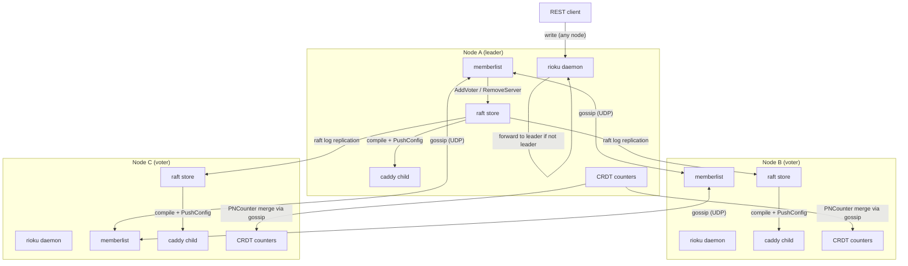

Rioku supports both single-node and multi-node deployments. Single-node uses SQLite and a no-op cluster service. Multi-node uses raft for config replication and memberlist (hashicorp/memberlist) for node discovery and health checking.

**How config changes propagate:**

1. A write hits any node's REST API.
2. If the node is not the raft leader, the request is forwarded to the leader.
3. The leader appends the change to the raft log and replicates it to a quorum.
4. Once committed, each node's `internal/sync` agent detects the change, recompiles the Caddy config, and pushes it to that node's Caddy child via the admin API.

**Single-node deployments** use `LocalOnlyService` (`internal/cluster/service.go`), which reports only the running daemon and routes `ForceSync` directly to a local Caddy reload. No raft or gossip is involved.

**CRDT usage:** `internal/cluster/crdt/counter.go` implements a `PNCounter`, a conflict-free replicated counter where each node increments its own partition locally (zero coordination latency) and counter state converges via periodic gossip merges. The primary use case is distributed rate-limit counters.

**Node roles:**

- `bootstrap`: founding node of a single-node or new cluster
- `voter`: full raft participant with a vote in leader elections
- `nonvoter`: replicates state but does not vote (read replicas, observer nodes)

**Source files:**

- `packages/daemon/internal/cluster/discovery.go`: memberlist-based gossip, `VoterManager` interface
- `packages/daemon/internal/cluster/service.go`: `Service` interface + `LocalOnlyService` (single-node default)
- `packages/daemon/internal/cluster/crdt/counter.go`: `PNCounter` CRDT
- `packages/daemon/internal/store/raft/`: raft store driver
- `packages/daemon/internal/sync/`: config recompile + Caddy push agent
