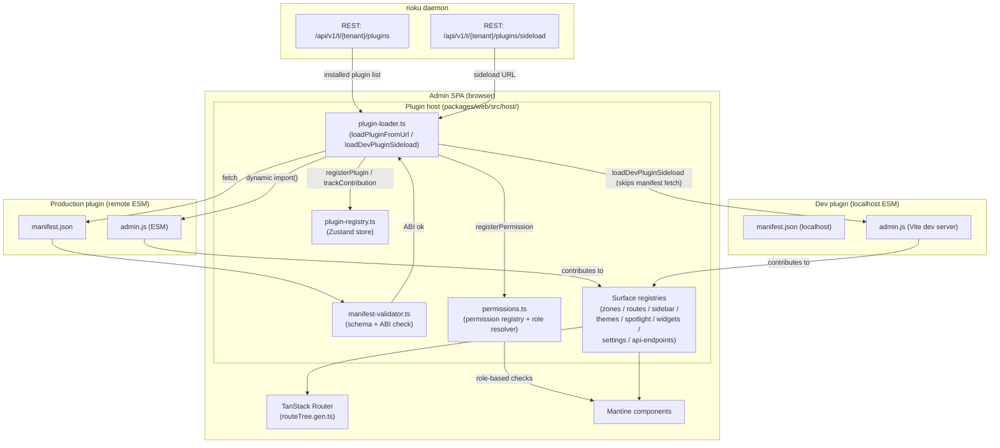

The plugin host is the TypeScript runtime inside the admin SPA that allows third-party plugins to contribute UI surfaces: sidebar entries, routes, zones, themes, spotlight commands, widgets, settings panels, and API endpoints. It is not an OS-level process — it runs entirely in the browser alongside the SPA.

**Load paths:**

| Path | Function | When used |
| --- | --- | --- |
| Production | `loadPluginFromUrl(manifestUrl)` | Installed plugins fetched from their hosted manifest URLs |
| Dev sideload | `loadDevPluginSideload(...)` | Localhost plugins injected via the sideload API; requires dev-mode gate to be active |
| Sandboxed (stub) | `loadSandboxedPlugin(manifestUrl)` | iframe isolation mode; creates the iframe and logs a postMessage handshake. Actual sandbox RPC is not yet implemented. |

**Contribution surfaces a plugin can register:**

- `zones`: named render zones in the SPA shell
- `routes`: additional TanStack Router routes
- `sidebar`: sidebar navigation entries
- `themes`: Mantine theme overrides
- `spotlight`: command palette entries
- `widgets`: dashboard widget types
- `settings`: settings panel pages
- `apiEndpoints`: additional REST endpoint declarations
- `permissions`: new permission strings added to the permission registry

**Unload** calls the unregister function for every tracked contribution, then removes the plugin from the registry. The surface registries are the authoritative rendering stores; the plugin registry is purely accounting.

**Dev-mode gate:** the sideload API is only reachable when the daemon is running with the dev-mode capability enabled. Production deployments reject sideload requests at the REST layer.

**Source files:**

- `packages/web/src/host/plugin-loader.ts`: load, validate, contribute, unload
- `packages/web/src/host/manifest-validator.ts`: JSON schema + ABI compatibility check
- `packages/web/src/host/plugin-registry.ts`: Zustand store tracking installed plugins
- `packages/web/src/host/permissions.ts`: permission registry + role-based resolution
- `packages/web/src/host/sidebar.ts`, `routes.ts`, `themes.ts`, `spotlight.ts`, `widgets.ts`, `zones.ts`: per-surface registries
- `packages/daemon/internal/gateway/plugins_routes.go`: daemon-side plugin REST API
