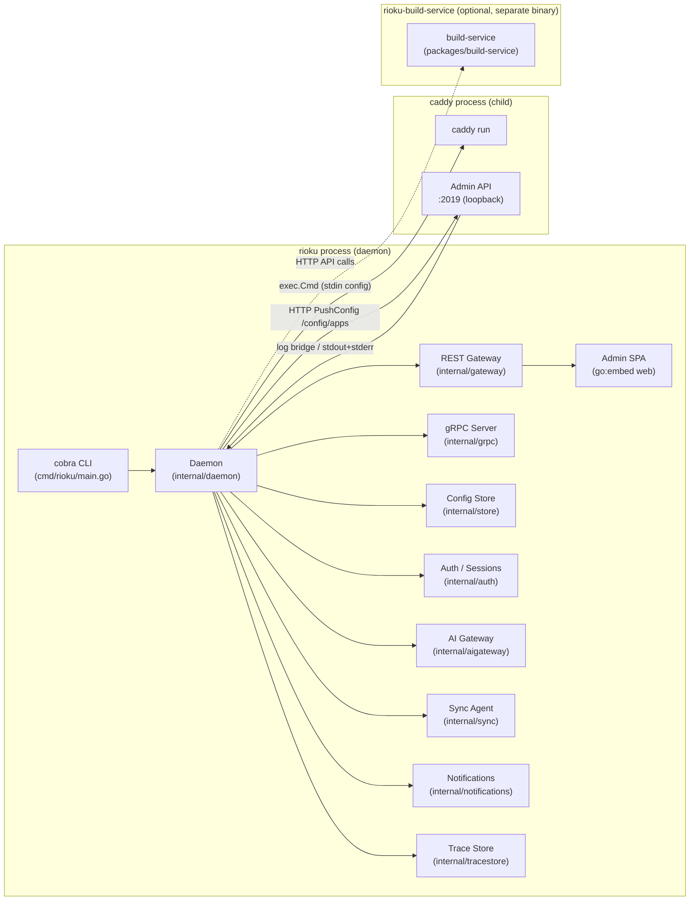

The `rioku` binary is a single Go executable that owns the full control plane. It manages a Caddy child process for traffic handling, embeds the admin SPA (via `go:embed`), and optionally coordinates with a separate build-service binary for hosted Caddy builds.

The key boundaries to understand:

- **Daemon owns Caddy as a child process.** The `caddy.Manager` in `internal/caddy/manager.go` launches Caddy with `exec.Command`, pipes a minimal JSON config via stdin to set the admin listen address, then communicates via the Caddy admin API at `localhost:2019`. Config changes are pushed via `POST /config/apps`. Caddy is stopped with `SIGTERM`; a 10-second timeout triggers `SIGKILL`.
- **No fork — stock Caddy binary.** Rioku uses an unmodified Caddy binary from the system path or `data_dir/../bin/caddy`. Custom Caddy builds (with additional plugins) are produced by the optional build-service.
- **The plugin host runs inside the admin SPA**, not as a separate OS process. See [Plugin Host](./plugin-host.md).
- **gRPC is internal.** The REST gateway (`internal/gateway`) uses grpc-gateway in-process server registration — it does not open a network gRPC connection. External clients speak REST to `:7778`. The gRPC server on `:7777` is reserved for node-to-node communication and the CLI.

**Source files:**
- `packages/daemon/internal/daemon/daemon.go` — `Daemon` struct; wires all subsystems
- `packages/daemon/internal/caddy/manager.go` — child process lifecycle and admin API push
- `packages/build-service/` — separate Go module; `rioku-build-service` binary
